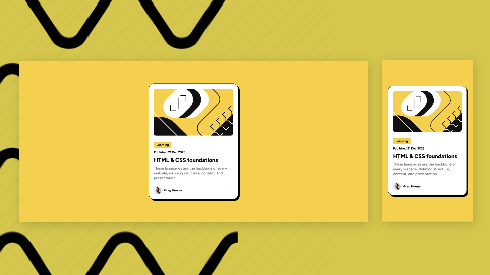

# Frontend Mentor - Blog preview card solution

This is a solution to the [Blog preview card challenge on Frontend Mentor](https://www.frontendmentor.io/challenges/blog-preview-card-ckPaj01IcS). Frontend Mentor challenges help you improve your coding skills by building realistic projects.

## Built with

- Semantic HTML5 markup
- CSS custom properties

## Screenshots



## View Live

You can view the live version of this project on GitHub Pages: [Blog preview](https://iamupo.github.io/blog-preview-card-main/)

## Connect with Me

Feel free to connect with me on:

- [LinkedIn](https://www.linkedin.com/in/iamupo/)
- [x](https://www.x.com/iamupo/)

## Getting Started

To get a copy of this project and run it locally, follow these steps:

1. Clone the repository:

   ```bash
   git clone https://github.com/IamUPO/blog-preview-card-main.git
